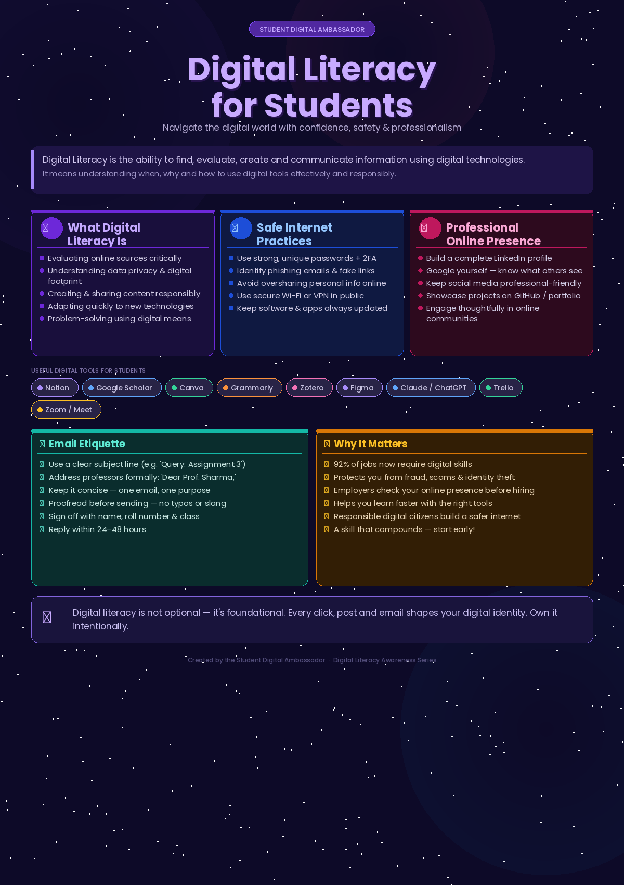

# Digital Literacy Infographic

A one-page visual resource created as part of the **Student Digital Ambassador** initiative to help students understand what Digital Literacy means and why it matters.

---

## About This Project

This infographic was designed to make digital literacy concepts accessible and visually engaging for students. It covers five key topics in a single, easy-to-read layout — combining clear visuals, colour-coded sections, and concise information so that anyone can understand the essentials of digital literacy at a glance.

---

## What's Covered

- **What Digital Literacy Is** — evaluating sources, understanding your digital footprint, creating content responsibly
- **Safe Internet Practices** — passwords, phishing, privacy, and secure browsing
- **Professional Online Presence** — LinkedIn, personal branding, and portfolio building
- **Useful Digital Tools for Students** — Notion, Google Scholar, Canva, Grammarly, Zotero, and more
- **Email Etiquette** — how to write professional emails to faculty and institutions

---

## Preview



---

## Repository Structure

```
📁 root
├── digital_literacy_infographic.png   ← Main infographic (download & share)
├── README.md                          ← This file
└── task-4-email-etiquette/
    ├── professional-emails.docx       ← Email etiquette drafts (Part A)
    └── social-media-checklist.md      ← Social media Do's & Don'ts (Part B)
```

---

## Tools Used

| Tool | Purpose |
|------|---------|
| **Claude AI** | Generating the infographic design, layout, and content |
| **Python (Pillow)** | Rendering the final high-resolution PNG image |
| **GitHub** | Version control and project sharing |

---

## How to Use

1. Download `digital_literacy_infographic.png`
2. Share it with your batchmates via WhatsApp, email, or your college LMS
3. Print it as a poster for your classroom or notice board
4. Embed it in presentations or reports using the image link above

---

## About the Initiative

This project is part of the **Student Digital Ambassador** programme, which aims to promote responsible, informed, and effective use of digital tools among college students. Digital literacy is not just a technical skill — it is a life skill that shapes how we learn, communicate, and present ourselves in an increasingly digital world.

---

*Created by the Student Digital Ambassador · Digital Literacy Awareness Series*
