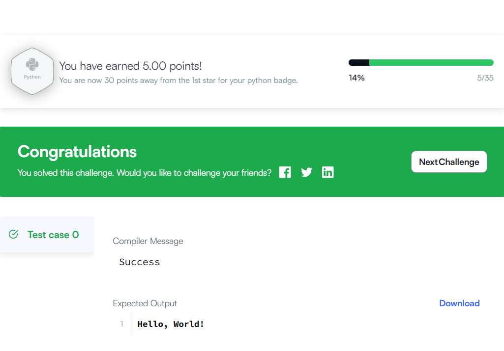
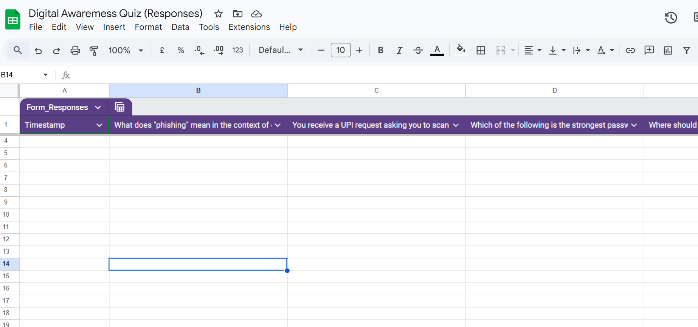

# Task 3 — Project Report Notes
**Student:** Hiral Jawarkar
**Programme:** B.Tech Bio-Engineering, 1st Year
**University:** VIT Bhopal University

## Platforms Used
- **HackerRank** — Online coding practice and challenge platform
- **Google Forms + Google Sheets** — Survey creation and response tracking (Google Workspace)

## What I Built / Practised
### HackerRank
Created an account and completed a beginner-level coding challenge. Practised breaking a problem into logical steps, writing code, and verifying output — the core loop of computational thinking.

### Google Forms
Designed a 5-question **Digital Literacy Awareness Quiz** for batchmates, covering phishing, UPI fraud, password safety, and cybercrime reporting. Linked the form to **Google Sheets** to enable live response tracking and data collection.

## How These Tools Will Help Me Academically
| Tool | Academic Relevance |
|---|---|
| HackerRank | Builds Python and algorithmic skills needed for bioinformatics, data modelling, and biosignal processing in later semesters |
| Google Forms | Useful for research surveys, lab data collection, and group project coordination |
| Google Sheets | Foundation for organising and analysing experimental or research data |

## Personal Reflection
> Starting with beginner challenges on HackerRank felt small, but it taught me that computational thinking — breaking a problem into steps — is the same skill I will need when analysing biological data. Similarly, building a Google Form showed me that data collection needs structure before it can be useful. Both tools are planting habits I will carry through four years of bio-engineering.

## Next Steps
- [ ] Progress to Python domain challenges on HackerRank each semester
- [ ] Use Google Forms for peer surveys in future research-based assignments
- [ ] Explore Google Sheets formulas for organising lab results
